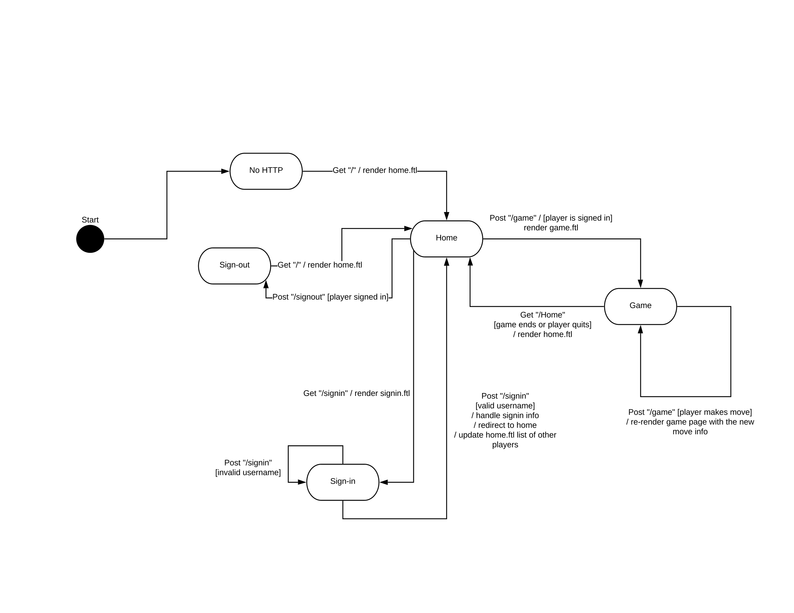

---
geometry: margin=1in
---
# PROJECT Design Documentation

## Team Information
* Team name: J3M
* Team members
  * Joshua Weiss
  * Max Hoecker
  * Jonathan Russo
  * Jacob Kobrak

## Executive Summary

This project focuses on the development of a web application which players can connect to in order to play a game of checkers with each other. Upon signing in under any alias they choose, they can see a list of players. If they click on a player, they can start a checkers game with that player.

### Purpose

Our primary user group is anyone with access to a modern web browser. Our goal is to deliver them a working game of checkers so they can temporarily forget about their imminent demise and how the time they and everyone they love have is rapidly running out.

### Glossary and Acronyms

| Term | Definition |
|------|------------|
| VO | Value Object |
| HTML | HyperText Markup Language |
|HTTP| HyperText Transfer Protocol |
|FreeMarkerEngine | Tool used to dynamically render HTML files|
|Username | An alias a user can be known on the web app as|

## Requirements
The basic requirements for this project are:

*  Every player must sign-in before playing a game, and be able to sign-out when finished playing.
*  Two players must be able to play a game of checkers based upon the American rules.
*  Either player of a game may choose to resign, at any point, which ends the game.

### Definition of MVP

The completeness of the MVP is defined by the incorporation of all of the above requirements, to the satisfaction of our god, Product Owner-sama.

### MVP Features
This application features:
* The ability to sign into the web app under any valid untaken username.
* The ability to see the number of players connected to the server if not signed in.
* The ability to see a full list of players upon sign-in.
* The ability to click on a listed player to start a checkers game with them, assuming neither player is already in a game.
* The ability to move a piece in accordance with the American rules of checkers.
* The ability to resign while in a game, ceding the win to the opponent.
* The ability to win a game of checkers, which triggers a return to the home screen as well as your assertion of dominance, superior intellect, and general aptitude as a human being over your fellow man.
* The ability to sign out.

### Roadmap of Enhancements
> _Provide a list of top-level features in the order you plan to consider them._

## Application Domain

This section describes the application domain.

> _Provide a high-level overview of the domain for this application. You
> can discuss the more important domain entities and their relationship
> to each other._

## Architecture and Design

This section describes the application architecture.

### Summary

The following Tiers/Layers model shows a high-level view of the webapp's architecture.

As a web application, the user interacts with the system using a
browser.  The client-side of the UI is composed of HTML pages with
some minimal CSS for styling the page.  There is also some JavaScript
that has been provided to the team by the architect.

The server-side tiers include the UI Tier that is composed of UI Controllers and Views.
Controllers are built using the Spark framework and View are built using the FreeMarker framework.  The Application and Model tiers are built using plain-old Java objects (POJOs).

Details of the components within these tiers are supplied below.

### Overview of User Interface

This section describes the web interface flow; this is how the user views and interacts
with the WebCheckers application.

When the user first connects to the web app, they are met with a home page with a link to the sign-in page at the top left corner of the screen. There, they can input a username. Once they do, they are redirected back to the home page, where they can now see a list of each player. By clicking a player, they are redirected to the game view

### UI Tier
> _Provide a summary of the Server-side UI tier of your architecture.
> Describe the types of components in the tier and describe their
> responsibilities.  This should be a narrative description, i.e. it has
> a flow or "story line" that the reader can follow._

> _At appropriate places as part of this narrative provide one or more
> static models (UML class structure or object diagrams) with some
> details such as critical attributes and methods._

> _You must also provide any dynamic models, such as statechart and
> sequence diagrams, as is relevant to a particular aspect of the design
> that you are describing.  For example, in WebCheckers you might create
> a sequence diagram of the `POST /validateMove` HTTP request processing
> or you might show a statechart diagram if the Game component uses a
> state machine to manage the game._

> _If a dynamic model, such as a statechart describes a feature that is
> not mostly in this tier and cuts across multiple tiers, you can
> consider placing the narrative description of that feature in a
> separate section for describing significant features. Place this after
> you describe the design of the three tiers._

### Application Tier
> _Provide a summary of the Application tier of your architecture. This
> section will follow the same instructions that are given for the UI
> Tier above._

### Model Tier
> _Provide a summary of the Application tier of your architecture. This
> section will follow the same instructions that are given for the UI
> Tier above._

### Design Improvements
> _Discuss design improvements that you would make if the project were
> to continue. These improvement should be based on your direct
> analysis of where there are problems in the code base which could be
> addressed with design changes, and describe those suggested design
> improvements. After completion of the Code metrics exercise, you
> will also discuss the resutling metric measurements.  Indicate the
> hot spots the metrics identified in your code base, and your
> suggested design improvements to address those hot spots._

## Testing
> _This section will provide information about the testing performed
> and the results of the testing._

### Acceptance Testing
> _Report on the number of user stories that have passed all their
> acceptance criteria tests, the number that have some acceptance
> criteria tests failing, and the number of user stories that
> have not had any testing yet. Highlight the issues found during
> acceptance testing and if there are any concerns._

### Unit Testing and Code Coverage
> _Discuss your unit testing strategy. Report on the code coverage
> achieved from unit testing of the code base. Discuss the team's
> coverage targets, why you selected those values, and how well your
> code coverage met your targets. If there are any anomalies, discuss
> those._
